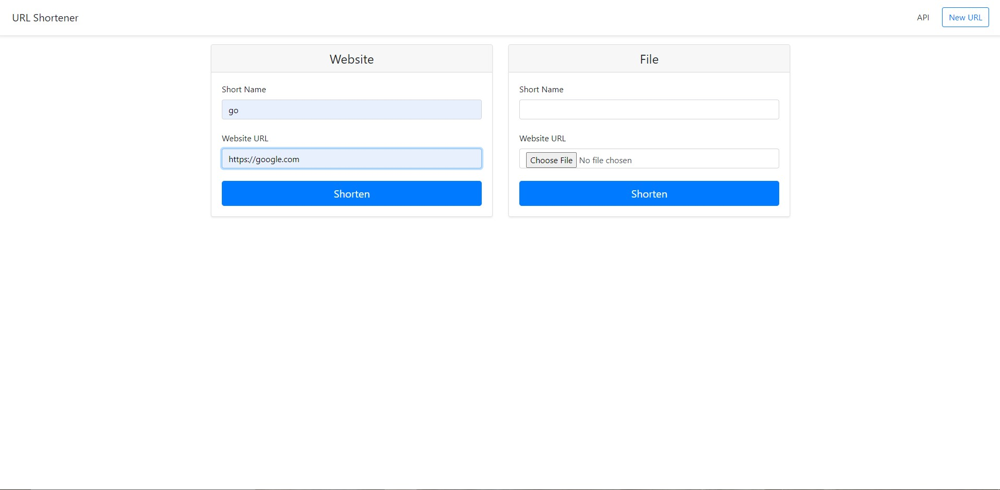
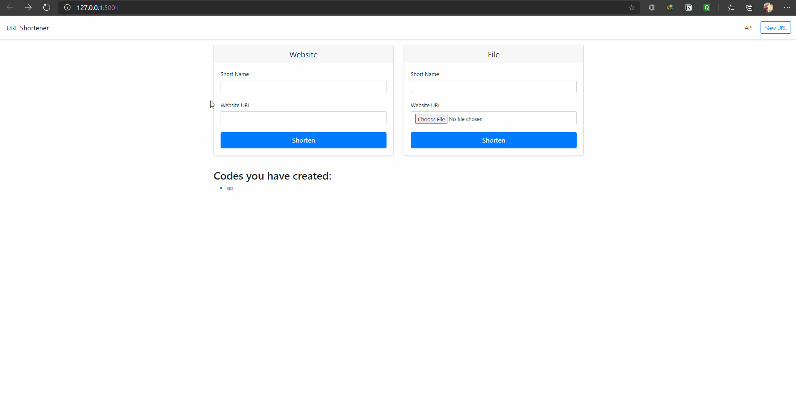

# Flasked-URL-Shortener

This is a simple URL shortener that uses a Flask Backend and is capable of shortening URLs as well as links for files. This also stores session history, incase you forget what you did recently. 😵

## How to Use

- Fork this repository and download using _git clone_.
  ```bash
  $git clone https://github.com/<username>/Flasked-URL-Shortener.git
  ```
- Install all the dependencies.

  ```powershell
  $pip install -r requirements.txt
  ```

  or,

  ```bash
  $pip3 install -r requirements.txt
  ```

  Or, you may use _pipenv_ or even _virtualenv_, if you don't want to install dependencies in your global setup.

  ```bash
  $pip3 install pipenv
  $pipenv install
  $pipenv shell
  $pipenv install flask
  ```

- Now run the web app.

  ```bash
  $export FLASK_ENV=development
  $export FLASK_APP=urlshort
  $flask run
  ```

  This will be followed up with this kind of output:

  ```bash
  * Serving Flask app "urlshort" (lazy loading)
  * Environment: development
  * Debug mode: on
  * Running on http://127.0.0.1:5000/ (Press CTRL+C to quit)
  * Restarting with inotify reloader
  * Debugger is active!
  * Debugger PIN: 333-177-060
  ```

  Visit the [http://127.0.0.1:5000/](http://127.0.0.1:5000/) link and there's the website.

## General Interface

<p align="center">
    
</p>

## Walkthrough

<p align="center">
    
</p>

## Additional Features

- You may run the already setup test configuration using these commands:
  ```bash
  $pipenv install pytest
  $pytest
  ```

---

## License

Distributed under the MIT License. See [LICENSE](LICENSE) for more information.

## Contact

Swapnanil Dutta - [@swapnanildutta1](https://twitter.com/swapnanildutta1) - swapnanildutta2000@gmail.com

Project Link: [https://github.com/swapnanildutta/Flasked-URL-Shortener](https://github.com/swapnanildutta/Flasked-URL-Shortener)
